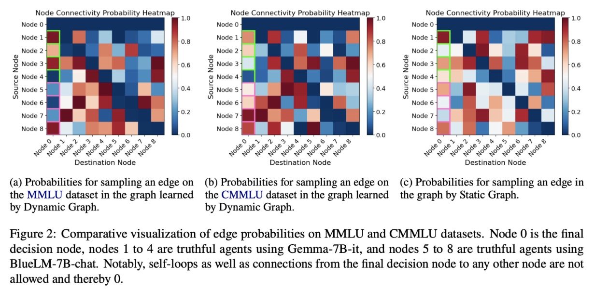

# DynamicGPTSwarm

## Introduction

Recent progress in the areas of Large Language Models (LLMs) and Language Agents has demonstrated significant promise for various future applications across multiple disciplines. Traditional approaches to language agents often rely on fixed, handcrafted designs. Our research aims to develop agents that are both learnable and dynamic, utilizing a graph framework to generate edges dynamically based on input.

In this framework, we learn a model that generates edges representing the flow of communication within the graph, adjusting the internal communication of a language agent. By fine-tuning a pretrained LLM with reinforcement learning on multiple datasets, we demonstrate that our approach surpasses static methods in accuracy and adaptability across various tasks. Specifically, our approach achieves nearly 6% higher accuracy on a combined dataset of MMLU and CMMLU, and over 10% higher with a sparsity-inducing loss.

## Features

- Dynamic edge generation based on input
- Training with reinforcement learning
- Supports multiple datasets simultaneously
- Superior performance on MMLU, CMMLU, and Mini Crossword Puzzles datasets

## Installation

To install and set up the repository, follow these steps:

1. Clone the repository:
   ```bash
   git clone https://github.com/lukasVierling/DynamicGPTSwarm.git
   cd DynamicGPTSwarm

    ```
2. Install the required dependencies:
    ```bash
    pip install -r requirements.txt
    ```

## Usage
To use the code, follow these steps:
```bash
python run_mmlu.py <arguments>
```
You can include one of the following arguments:

- `mode`: str (default: 'OptimizedSwarm') - Mode of operation.
- `num_truthful_agents`: int (default: 1) - Number of truthful agents.
- `num_adversarial_agents`: int (default: 1) - Number of adversarial agents.
- `num_iterations`: int (default: 200) - Number of optimization iterations.
- `model_name`: str or List[str] (default: ["google/gemma-7B-it"]) - Model names.
- `domain`: str (default: "mmlu") - Domain (same as dataset name).
- `debug`: bool (default: False) - Set for a quick debug cycle.
- `edge_network_enable`: bool (default: False) - Enable edge network.
- `reproduce`: bool (default: False) - Set seed to 0 for deterministic training data.
- `lr`: float (default: 0.0001) - Learning rate for edge network optimization.
- `reduce_edges`: bool (default: False) - Reduce edges.
- `delta`: float (default: 0.2) - Weight for edge reduction.
- `embedding_only`: bool (default: False) - Set for only embedding optimization.


## Results

We demonstrate that our approach surpasses the previous static approach by nearly 6% accuracy on a combined dataset of MMLU and CMMLU, and by more than 10% when trained with a sparsity-inducing loss. It also shows superior performance in additional experiments conducted with the MMLU and Mini Crossword Puzzles datasets.

### Acknowledgments

This research builds upon the work by [Zhuge et al.](https://arxiv.org/abs/2402.16823) Their original code base can be found [here](https://github.com/metauto-ai/GPTSwarm).

### Contact

For any questions or issues, please open an issue on this repository or contact us at [lvierling@ust.connect.hk](lvierling@ust.connect.hk).

### Citation

If you find this work useful for your research, please consider citing (TODO: add citation):
```
@article{AuthorYear,
  author = {Author},
  title = {Title},
  journal = {Journal},
  year = {Year},
  doi = {DOI},
  url = {URL}
}
```